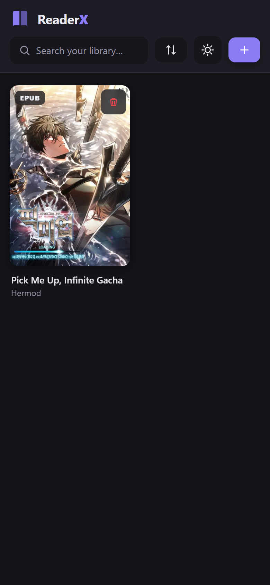
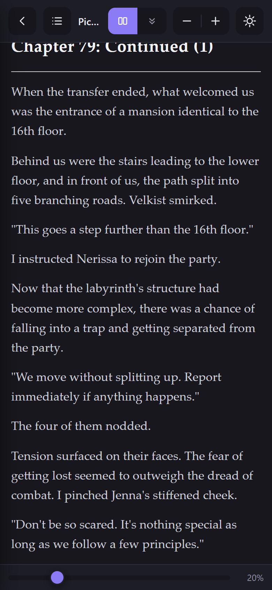
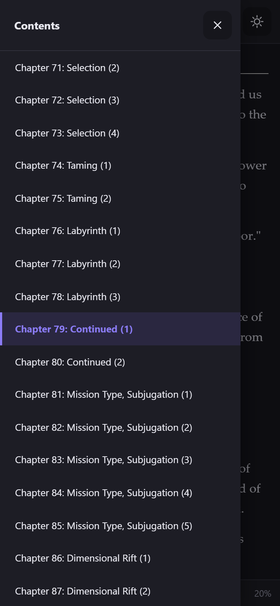
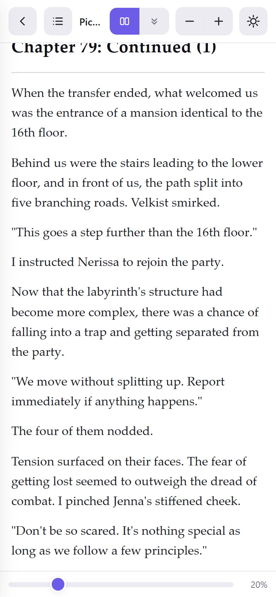
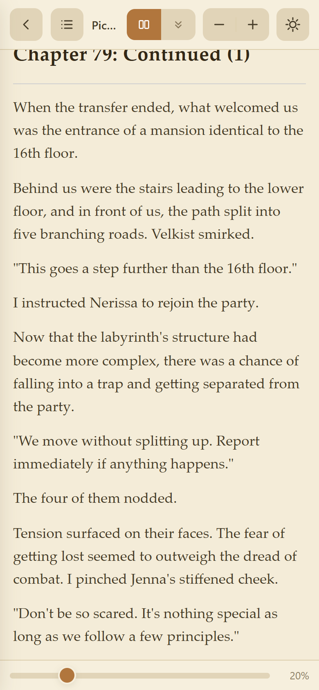

<div align="center">


# ReaderX

**A clean, modern EPUB &amp; PDF reader — your whole library, offline, on any device.**

Add your books, then read with page-turning or seamless infinite scroll.
Progress saves itself, covers and inline images load, and nothing ever leaves your device.

<p>
  
  
  
  
</p>

<p>
  
  
  
</p>

<sub>Library&nbsp;&nbsp;·&nbsp;&nbsp;Reader&nbsp;&nbsp;·&nbsp;&nbsp;Table of contents</sub>

</div>

---

## ✨ Highlights

- 📚 **One library, two formats** — import **EPUB** and **PDF** files side by side. Covers, titles and authors are read automatically.
- 📖 **Two ways to read** — flip **pages** with a tap or swipe, or switch to **continuous scroll** with seamless infinite loading. Change mode any time.
- 🔖 **Never lose your place** — reading progress is saved continuously and restored when you reopen a book. Every cover shows a progress bar.
- 🗂️ **Table of contents** — jump straight to any chapter (EPUB navigation or PDF outline).
- 🎨 **Three themes** — Light, Sepia and Dark, applied to the app *and* the book's pages.
- 🔍 **Search &amp; sort** — filter by title or author; sort by Recent, Title or Date added.
- 🖼️ **Real EPUB rendering** — inline images, chapter styling and embedded fonts, powered by epub.js.
- 📱 **Mobile-first** — a gesture-driven UI with an edge-to-edge layout that respects the device's system bars.
- 🔌 **Works offline** — installable as a PWA or a native Android app. No account, no cloud, no server.

<div align="center">
<br>



<br>
<sub>The same page in Light, Sepia and Dark</sub>
</div>

---

## 📲 Download for Android

Grab the signed APK from the **[latest release](https://github.com/Toastaspiring/reader-x/releases/latest)**:

### → [Download ReaderX.apk](https://github.com/Toastaspiring/reader-x/releases/latest/download/ReaderX.apk)

1. Copy the APK to your Android phone, or download it directly on the device.
2. Open it and allow *Install unknown apps* if prompted.
3. ReaderX installs like any normal app.

> Requires Android 7.0 (API 24) or newer. The APK is self-signed, so the installer
> warns that it comes from an "unknown developer" — that is expected for a sideloaded app.

---

## 💻 Run the web app

ReaderX is a plain static site — no build step, nothing to install.

**Windows** — double-click **`start.bat`**. It serves the app locally and opens `http://localhost:8765/`.

**Anything else** — serve the folder with any static server:

```bash
python -m http.server 8765
# then open http://localhost:8765/
```

You can also open `index.html` straight from disk — the library and reading still work; a
local server just unlocks PDF speed-ups, offline mode and PWA install.

### Install it as an app

With ReaderX open in Chrome or Edge, choose **Install** from the address bar or browser
menu. It then runs in its own window with the ReaderX icon, fully offline.

---

## 👆 Using ReaderX

**Add books** — tap **Add books**, or drag EPUB / PDF files onto the window (desktop).

**Read** — tap any book. Two modes, switchable any time via the **Pages / Scroll** toggle:

| Mode | Gesture |
|---|---|
| **Pages** | Tap the left / right screen edge, or swipe, to turn the page |
| **Scroll** | One continuous flow — keep scrolling and pages stream in |

Tap the **centre** of the screen to show or hide the toolbars.

**Toolbar**

| Control | What it does |
|---|---|
| **Contents** | Open the chapter list and jump anywhere |
| **Pages / Scroll** | Switch reading mode |
| **A− / A+** | Text size (EPUB) or zoom (PDF) |
| **Theme** | Cycle Light → Sepia → Dark |
| **Slider** | Scrub to any point in the book |

**Keyboard** (desktop)

| Key | Action |
|---|---|
| `→` `←` `Space` | Next / previous page |
| `+` `−` | Text size / zoom |
| `Esc` | Close contents, or return to the library |

---

## 🛠️ How it works

ReaderX is a zero-build static web app. Everything runs in the browser; books live in
**IndexedDB** on your own device.

| File | Role |
|---|---|
| `index.html` | App shell — library and reader views |
| `css/style.css` | Theming, layout, the entire UI |
| `js/storage.js` | IndexedDB wrapper — books &amp; reading progress |
| `js/library.js` | Import, metadata, cover thumbnails, the grid |
| `js/epub-reader.js` | EPUB rendering &amp; pagination (epub.js) |
| `js/pdf-reader.js` | PDF rendering (pdf.js) |
| `js/app.js` | View routing, reader chrome, preferences |
| `vendor/` | epub.js, pdf.js, JSZip — bundled for offline use |
| `sw.js` + `manifest.json` | Service worker + PWA manifest |

**Built on** — [epub.js](https://github.com/futurepress/epub.js) · [pdf.js](https://mozilla.github.io/pdf.js/) · [JSZip](https://stuk.github.io/jszip/). No framework, no bundler.

---

## 📦 Building the Android APK

The Android app is a thin [Capacitor](https://capacitorjs.com/) wrapper around this exact
web app. To reproduce it:

```bash
npm install @capacitor/core @capacitor/cli @capacitor/android
npx cap init ReaderX com.readerx.app --web-dir www

# copy the web app (index.html, css/, js/, vendor/, icons/, manifest.json, sw.js) into www/

npx cap add android
npx cap sync
cd android && ./gradlew assembleRelease
```

The release build is signed with a local keystore (`keystore.properties` + a `signingConfig`
in `app/build.gradle`); the resulting `app-release.apk` is published as the `ReaderX.apk`
asset on the [Releases page](https://github.com/Toastaspiring/reader-x/releases).

Key Android settings: `minSdk 24`, `targetSdk 35` — so the edge-to-edge opt-out is honoured
and the layout sits correctly under the status and navigation bars.

---

## 🔒 Privacy

ReaderX has no account, no analytics and makes no network calls. Your books and your reading
position are stored only on your device — the browser's IndexedDB on the web, or the app's
private storage on Android. Removing a book deletes it; clearing the app or site data erases
the library.

---

<div align="center">
<sub>ReaderX · built with epub.js &amp; pdf.js</sub>
</div>
